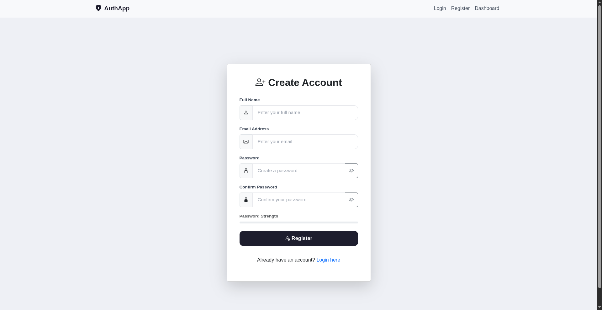
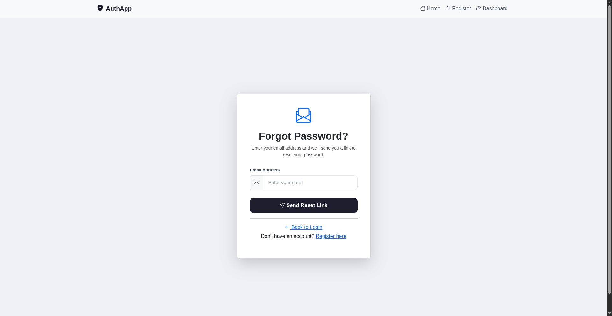
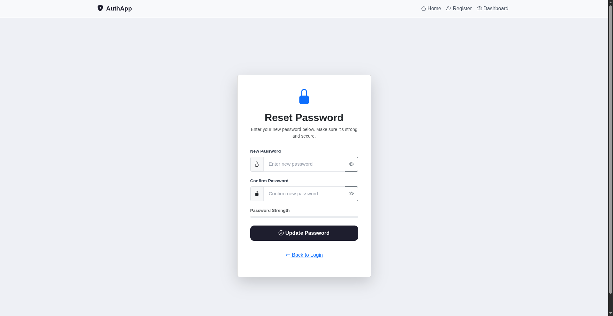
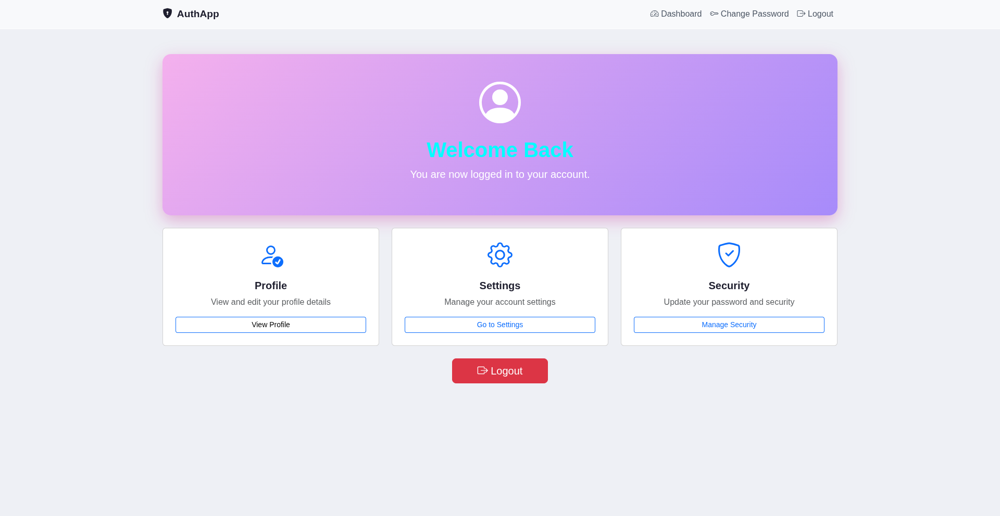

# AuthApp - Authentication System Styling
### Fullstack Java Development - Assignment 2 | CampusPe

---

## 📌 Project Overview

This project is a styled version of the Assignment 1 HTML authentication system.
All 5 pages have been transformed into a professional, responsive, and visually
appealing application using **Bootstrap 5** and **custom CSS**.

---

## 🚀 Pages Included

| Page | File | Description |
|------|------|-------------|
| Login | `index.html` | Users can sign in to their account |
| Register | `register.html` | New users can create an account |
| Forgot Password | `forgot-password.html` | Request a password reset link |
| Reset Password | `reset-password.html` | Set a new password securely |
| Dashboard | `dashboard.html` | User dashboard after successful login |

---

## ✨ Features

- ✅ Bootstrap 5 integrated on all pages
- ✅ Responsive design — works on mobile, tablet, laptop, desktop
- ✅ Custom color scheme with purple accent palette
- ✅ Google Fonts (DM Sans) for clean typography
- ✅ Glassmorphism login card with soft blob background
- ✅ Bootstrap navbar with hamburger menu for mobile
- ✅ Hover effects and smooth transitions on buttons and links
- ✅ Box shadows on all cards
- ✅ Password strength indicator (Register & Reset Password pages)
- ✅ Show/Hide password toggle on password fields
- ✅ Live password match checker on Reset Password page
- ✅ Page navigation flow: Login → Register → Forgot Password → Reset Password → Dashboard

---

## 🎨 Tech Stack

- HTML5
- CSS3 (custom `styles.css`)
- Bootstrap 5.3.3
- Bootstrap Icons 1.11.3
- Google Fonts — DM Sans

---

## 📁 Project Structure
```
authentication-system-styled/
├── index.html           # Login Page
├── register.html        # Registration Page
├── forgot-password.html # Forgot Password Page
├── reset-password.html  # Reset Password Page
├── dashboard.html       # Dashboard Page
├── styles.css           # Custom CSS styles
├── README.md            # Project documentation
└── screenshots/
    ├── login.png
    ├── register.png
    ├── forgot-password.png
    ├── reset-password.png
    └── dashboard.png
```

---

## 🔁 User Flow
```
Login → Forgot Password → Reset Password → Login → Dashboard
           ↕
        Register
```

---

## 📸 Screenshots

### Login Page


### Register Page


### Forgot Password Page


### Reset Password Page


### Dashboard Page


---

## 📱 Responsive Breakpoints

| Device | Screen Size |
|--------|-------------|
| Mobile | 320px - 767px |
| Tablet | 768px - 1024px |
| Laptop | 1366px - 1920px |
| Desktop | 1920px and above |

---

## 🏫 Course Details

- **Institution:** CampusPe — Tattva Code Labs
- **Course:** Fullstack Java Development
- **Assignment:** Assignment 2 — Authentication System Styling
- **Mentor:** Jacob Dennis
